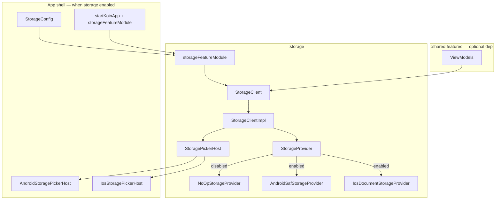

# Storage Module — Design Spec

**Date:** 2026-06-30  
**Status:** Approved (brainstorming)  
**Scope:** Standalone optional `:storage` KMP Gradle module for user-picked folder access and file CRUD via Android SAF and iOS document picker; `StorageClient` facade; swappable `StorageProvider` + app-supplied `StoragePickerHost`

---

## Summary

Add a new Gradle module `:storage` that exposes a single **`StorageClient`** facade, configured once at Koin init via `storageFeatureModule(StorageConfig(...))`. Platform file I/O lives behind **`StorageProvider`** (default: SAF on Android, security-scoped URLs on iOS). The system folder picker lives behind **`StoragePickerHost`**, supplied by the app shell at init — the module owns the contract and maps results to opaque **`StorageLocationToken`** values.

When `enabled = false`, all calls no-op via **`NoOpStorageProvider`**. Features inject `StorageClient` directly when they opt in — no `:domain` / `:data` changes.

Unlike `:analytics`, **`:shared` does not depend on `:storage` by default**. Apps add the Gradle dependency and Koin module only when a feature needs user-picked storage.

**Permissions:** No Android/iOS **runtime storage permissions** are required for v1. User authorization happens through the system document/folder picker plus persistable grants (Android) or security-scoped bookmarks (iOS). Do **not** add `READ_EXTERNAL_STORAGE`, `WRITE_EXTERNAL_STORAGE`, or `MANAGE_EXTERNAL_STORAGE` for this module.

---

## Requirements (decisions)

| Requirement | Decision |
|-------------|----------|
| Module shape | New Gradle module `:storage` (not packages in `:domain`/`:data`) |
| Scope (v1) | User-picked folders only — no app-private dirs, no broad storage |
| CRUD (v1) | File read, write, delete, exists, list children (non-recursive) |
| Folder pick | System picker with `Read`, `Write`, or `ReadWrite` access mode |
| Runtime permissions | **None** — SAF / document picker grants only; leave manifest clean |
| Swapping | Custom `StorageProvider` via `StorageConfig`; picker via `StoragePickerHost` |
| Consumption | Direct `StorageClient` injection in ViewModels |
| Configuration | Init-time — `StorageConfig(enabled = …, pickerHost = …)` |
| Optional integration | No `:shared` dep by default; wire Gradle + Koin only when needed |
| Domain/data | None — `:storage` is infrastructure |
| Token persistence | Opaque `StorageLocationToken` returned to consumer; **consumer** persists if needed across sessions |
| Out of scope (v1) | App-private dirs, streaming I/O, directory change observation, folder create/delete, recursive listing, encrypted storage, runtime permission helpers |

---

## Approach

**Chosen:** Thin facade + `StorageProvider` (I/O) + `StoragePickerHost` (UI bridge from app shell) + `NoOp` when disabled.

**Rejected:**

| Alternative | Why not |
|-------------|---------|
| Full KMP playbook (`StorageRepository` in `:domain`) | User chose standalone core package; matches `:billing` / `:analytics` |
| Picker fully inside `:storage` without app shell | Requires `Activity` / `UIViewController`; breaks app boundary conventions |
| Raw `Uri` / `NSURL` in public API | Couples consumers to platform types |
| Module-owned grant registry (internal DataStore) | Adds state and coupling; opaque token + consumer persistence is simpler for v1 |
| Legacy storage permissions + file paths | Conflicts with scoped-storage policy; not needed for SAF |

---

## Architecture



### Dependency graph

```
:androidApp  → :storage (when enabled), :shared, :data.di
:shared      → :storage (only when a feature uses StorageClient)
:storage     → koin, coroutines; androidMain: documentfile
:domain      → (unchanged — no storage)
:data        → (unchanged — no storage)
```

Konsist: `:shared` may depend on `:storage` when opted in — same category as `:billing` (infrastructure). `:domain` and `:data` must not import `:storage`.

---

## Permissions & platform authorization

### Android

| Mechanism | Required? |
|-----------|-----------|
| `READ_EXTERNAL_STORAGE` / `WRITE_EXTERNAL_STORAGE` | **No** — not used |
| `MANAGE_EXTERNAL_STORAGE` | **No** — out of scope |
| `requestPermissions()` for storage | **No** — do not implement |
| `ACTION_OPEN_DOCUMENT_TREE` + user pick | **Yes** — authorization UI |
| `takePersistableUriPermission(uri, flags)` | **Yes** — after successful pick; flags match `StorageAccessMode` |

Encode the tree URI (and optional display name) into `StorageLocationToken.value`. CRUD uses `DocumentFile.fromTreeUri` + `ContentResolver`.

### iOS

| Mechanism | Required? |
|-----------|-----------|
| Photo Library / Files privacy usage strings for picker | **No** for general document picker |
| `requestAuthorization` for storage | **No** |
| `UIDocumentPickerViewController` | **Yes** — authorization UI |
| Security-scoped bookmark + `startAccessingSecurityScopedResource()` | **Yes** — wrap all I/O |

Encode bookmark data (e.g. base64) into `StorageLocationToken.value`.

### Module responsibility

- Document in README: **no runtime permission wiring**
- Map revoked/expired grants → `StorageError.PermissionDenied`
- Map user dismiss → `StorageResult.Cancelled`
- Do **not** add permission request helpers or manifest storage permissions in v1

---

## Public API

**Package:** `com.devindie.myday.storage.api`  
**Do not import** `com.devindie.myday.storage.impl` from app code.

### StorageClient

```kotlin
interface StorageClient {
    /**
     * Presents the system folder picker (via [StoragePickerHost]).
     * Returns an opaque token the consumer may persist for later CRUD.
     */
    suspend fun pickFolder(request: StoragePickRequest): StorageResult<StorageLocationToken>

    /** Lists immediate children of [relativePath] under the picked root (non-recursive). */
    suspend fun list(
        token: StorageLocationToken,
        relativePath: String = "",
    ): StorageResult<List<StorageEntry>>

    suspend fun exists(
        token: StorageLocationToken,
        relativePath: String,
    ): StorageResult<Boolean>

    suspend fun readText(
        token: StorageLocationToken,
        relativePath: String,
    ): StorageResult<String>

    suspend fun readBytes(
        token: StorageLocationToken,
        relativePath: String,
    ): StorageResult<ByteArray>

    suspend fun writeText(
        token: StorageLocationToken,
        relativePath: String,
        text: String,
    ): StorageResult<Unit>

    suspend fun writeBytes(
        token: StorageLocationToken,
        relativePath: String,
        bytes: ByteArray,
    ): StorageResult<Unit>

    suspend fun delete(
        token: StorageLocationToken,
        relativePath: String,
    ): StorageResult<Unit>
}
```

### Models (`StorageModels.kt`)

Platform-agnostic types only:

```kotlin
enum class StorageAccessMode {
    /** Read-only tree access (Android: read URI flag). */
    Read,

    /** Write-only is expressed as pick + write operations; Android still uses tree URI with write flag. */
    Write,

    /** Read and write (Android: read + write persistable flags). */
    ReadWrite,
}

data class StoragePickRequest(
    val accessMode: StorageAccessMode,
)

@JvmInline
value class StorageLocationToken(val value: String)

data class StorageEntry(
    val name: String,
    val relativePath: String,
    val isDirectory: Boolean,
    val sizeBytes: Long?,
    val lastModifiedEpochMillis: Long?,
)

sealed interface StorageResult<out T> {
    data class Success<T>(val value: T) : StorageResult<T>
    data class Failure(val error: StorageError) : StorageResult<Nothing>
    data object Cancelled : StorageResult<Nothing>
}

sealed interface StorageError {
    data object NotConfigured : StorageError
    data object PermissionDenied : StorageError
    data object NotFound : StorageError
    data class InvalidPath(val relativePath: String) : StorageError
    data class Io(val message: String, val cause: Throwable? = null) : StorageError
}
```

Path rules (v1):

- `relativePath` uses `/` separators, no leading slash, empty string = picked root
- `..` segments rejected → `InvalidPath`
- Write: overwrite existing file; create new file if parent exists;  tree; no automatic mkdir chain

### Provider contracts (swappable)

```kotlin
interface StorageProvider {
    suspend fun list(token: StorageLocationToken, relativePath: String): StorageResult<List<StorageEntry>>
    suspend fun exists(token: StorageLocationToken, relativePath: String): StorageResult<Boolean>
    suspend fun readBytes(token: StorageLocationToken, relativePath: String): StorageResult<ByteArray>
    suspend fun writeBytes(token: StorageLocationToken, relativePath: String, bytes: ByteArray): StorageResult<Unit>
    suspend fun delete(token: StorageLocationToken, relativePath: String): StorageResult<Unit>
}

interface StoragePickerHost {
    suspend fun pickFolder(request: StoragePickRequest): StorageResult<StorageLocationToken>
}
```

### Config

```kotlin
data class StorageConfig(
    val enabled: Boolean = false,
    val pickerHost: StoragePickerHost? = null,
    val provider: StorageProvider? = null,
)
```

- `enabled == false` → `NoOpStorageProvider`; picker not invoked
- `enabled == true` → requires non-null `pickerHost` (Koin init fails fast or `pickFolder` returns `NotConfigured` if null — prefer fail-fast at module creation)
- `provider == null` → platform default from `expect`/`actual` (`AndroidSafStorageProvider` / `IosDocumentStorageProvider`)
- `provider != null` → custom (tests / future backends)

### Koin module

```kotlin
fun storageFeatureModule(config: StorageConfig): Module
```

Registers `single<StorageClient> { StorageClientImpl(...) }`. Public entry delegates to internal `createStorageModule(config)` in `impl/`, mirroring `:billing`.

---

## Internal implementation

### Module layout

```
storage/
├── build.gradle.kts
├── README.md
└── src/
    ├── commonMain/kotlin/com/devindie/myday/storage/
    │   ├── api/
    │   │   ├── StorageClient.kt
    │   │   ├── StorageConfig.kt
    │   │   ├── StorageModels.kt
    │   │   ├── StorageFeatureModule.kt
    │   │   └── provider/
    │   │       ├── StorageProvider.kt
    │   │       └── StoragePickerHost.kt
    │   └── impl/
    │       ├── StorageClientImpl.kt
    │       ├── StorageModule.kt
    │       ├── StoragePathValidator.kt
    │       └── provider/NoOpStorageProvider.kt
    ├── androidMain/kotlin/.../impl/
    │   ├── AndroidSafStorageProvider.kt
    │   ├── SafUriCodec.kt
    │   └── StorageModule.android.kt
    ├── iosMain/kotlin/.../impl/
    │   ├── IosDocumentStorageProvider.kt
    │   ├── SecurityScopedBookmarkCodec.kt
    │   └── StorageModule.ios.kt
    ├── jvmMain/kotlin/.../impl/StorageModule.jvm.kt
    └── commonTest/kotlin/.../
        ├── api/StorageModelsTest.kt
        ├── impl/StorageClientImplTest.kt
        ├── impl/StoragePathValidatorTest.kt
        └── impl/provider/NoOpStorageProviderTest.kt
```

### StorageClientImpl

- Delegates CRUD to `StorageProvider`; `pickFolder` to `StoragePickerHost`
- Validates `relativePath` before provider calls
- `readText` / `writeText`: UTF-8 via `readBytes` / `writeBytes`
- Catches unexpected exceptions → `StorageResult.Failure(StorageError.Io(...))` — never throws to ViewModels

### NoOpStorageProvider

```kotlin
internal class NoOpStorageProvider : StorageProvider {
    // all CRUD → Failure(NotConfigured)
}
```

`pickFolder` when disabled → `Failure(NotConfigured)`.

### AndroidSafStorageProvider

- Decode token → tree `Uri`
- `DocumentFile.fromTreeUri` for navigation
- `ContentResolver.openInputStream` / `openOutputStream` for bytes
- Write mode: verify write flag was granted at pick time; else `PermissionDenied`
- Dependencies: `androidx.documentfile:documentfile` (already in version catalog)

### IosDocumentStorageProvider

- Decode token → security-scoped bookmark URL
- `startAccessingSecurityScopedResource()` / `stopAccessingSecurityScopedResource()` in `try/finally` around each operation
- Use `NSFileManager` for list/exists/delete; `NSData` / streams for read/write

### StoragePickerHost (app shell — not in `:storage` v1)

**Android** (`androidApp`):

- `ActivityResultContracts.OpenDocumentTree()`
- On result: `takePersistableUriPermission` with flags from `StorageAccessMode`
- Return `StorageLocationToken(uri.toString())` or encoded JSON if metadata needed

**iOS** (`shared/iosMain` or `iosApp`):

- Present `UIDocumentPickerViewController` for folder
- Create security-scoped bookmark → base64 → `StorageLocationToken`

---

## App wiring

### Android (`androidApp`)

```kotlin
// Register picker host + Koin — no storage permissions in manifest
startKoinApp(
    appModules = listOf(
        storageFeatureModule(
            StorageConfig(
                enabled = true,
                pickerHost = AndroidStoragePickerHost(activityProvider),
            ),
        ),
    ),
) { androidContext(this@MyDayApplication) }
```

`AndroidStoragePickerHost` holds a way to launch `OpenDocumentTree` (e.g. `ComponentActivity` registry or callback set from `MainActivity`).

### iOS

```kotlin
// KoinIos.kt
storageFeatureModule(
    StorageConfig(
        enabled = true,
        pickerHost = IosStoragePickerHost(),
    ),
)
```

Bridge picker presentation to Swift/Compose host as needed.

### Swapping provider (tests)

```kotlin
storageFeatureModule(
    StorageConfig(
        enabled = true,
        pickerHost = FakeStoragePickerHost(),
        provider = FakeStorageProvider(),
    ),
)
```

---

## Optional integration checklist

Apps **without** user-picked storage:

- Do **not** add `implementation(projects.storage)` to `:shared`
- Do **not** register `storageFeatureModule` in Koin
- Module may remain in repo (`include(":storage")`) for template users

Apps **with** storage:

- [ ] `include(":storage")` in `settings.gradle.kts`
- [ ] `implementation(projects.storage)` in consuming module + `:androidApp` (for picker host)
- [ ] `storageFeatureModule(StorageConfig(enabled = true, pickerHost = …))` in Koin
- [ ] Implement `AndroidStoragePickerHost` / `IosStoragePickerHost` in app shell
- [ ] **Do not** add storage runtime permissions to manifest
- [ ] Consumer persists `StorageLocationToken` if access must survive process death (e.g. DataStore in feature)

---

## Usage example

```kotlin
class VaultSetupViewModel(
    private val storage: StorageClient,
) : ViewModel() {
    private var root: StorageLocationToken? = null

    fun pickVaultFolder() {
        viewModelScope.launch {
            when (val result = storage.pickFolder(
                StoragePickRequest(StorageAccessMode.ReadWrite),
            )) {
                is StorageResult.Success -> {
                    root = result.value
                    // persist result.value.value if needed
                }
                is StorageResult.Cancelled -> Unit
                is StorageResult.Failure -> { /* show result.error */ }
            }
        }
    }

    fun loadReadme() {
        val token = root ?: return
        viewModelScope.launch {
            when (val result = storage.readText(token, "README.md")) {
                is StorageResult.Success -> { /* use result.value */ }
                is StorageResult.Failure -> { /* handle PermissionDenied, NotFound, etc. */ }
                is StorageResult.Cancelled -> Unit
            }
        }
    }
}
```

---

## Gradle / project changes

| File | Purpose |
|------|---------|
| `storage/build.gradle.kts` | KMP library; koin; coroutines; documentfile on androidMain |
| `storage/README.md` | Integration guide — picker hosts, no permissions, verify checklist |
| `settings.gradle.kts` | `include(":storage")` |
| `build.gradle.kts` | Add `:storage:allTests` to `qualityCheck` |
| `architecture/.../LayerDependencyTest.kt` | `:domain` / `:data` must not import `:storage` |

**Not modified by default:** `shared/build.gradle.kts`, `AndroidManifest.xml` (no new permissions), app Koin entry — documented in README only.

---

## Testing & verification

| Test | Cases |
|------|-------|
| `StorageModelsTest` | Result wrappers; token inline class |
| `StoragePathValidatorTest` | Rejects `..`, leading `/`, blank segments |
| `StorageClientImplTest` | Delegates to fakes; text encoding; maps exceptions |
| `NoOpStorageProviderTest` | Disabled path returns `NotConfigured` |
| `:architecture:test` | `:domain` / `:data` do not import `:storage` |

```bash
./gradlew :storage:allTests
./gradlew :architecture:test
./gradlew :storage:compileKotlinIosSimulatorArm64
```

### Manual

| Check | Expected |
|-------|----------|
| Pick folder ReadWrite (Android) | No permission dialog; CRUD works on picked tree |
| Pick folder (iOS) | Document picker only; read/write under scoped URL |
| User revokes access in system settings | CRUD → `PermissionDenied` |
| User cancels picker | `StorageResult.Cancelled` |
| `enabled = false` | All operations → `NotConfigured` |

---

## Error handling

| Scenario | Behavior |
|----------|----------|
| `enabled = false` | CRUD + pick → `NotConfigured` |
| User cancels picker | `Cancelled` |
| Grant revoked / bookmark stale | `PermissionDenied` |
| Missing file | `NotFound` |
| Malformed relative path | `InvalidPath` |
| I/O failure | `Io` with message; logged in debug |
| Unexpected exceptions | Wrapped in `Io`; app does not crash |

---

## Out of scope (v1)

- Android/iOS runtime storage permission requests or manifest entries
- App-private storage (`filesDir`, cache, Documents without picker)
- Recursive directory listing
- Folder create/delete
- Streaming read/write for large files
- `Flow` of directory changes
- Module-internal grant registry / DataStore
- Domain use cases / `StorageRepository` in `:domain`
- Sample vault feature wired into main navigation

---

## Future extensions

- `StorageClient.observeEntries(token, path): Flow<List<StorageEntry>>`
- Streaming API for large files
- Optional `storageLocationStore` helper in module for token persistence
- Compose helper `rememberStoragePickerLauncher` in `storage/api/compose/` (Android)
- Gradle convention plugin `cmp.storage` for one-line setup
- Typed feature constants for known relative paths
