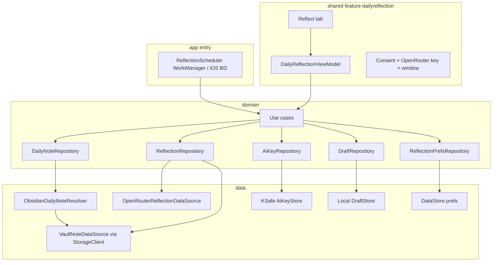

# Daily Reflection — Design Spec

**Date:** 2026-07-11  
**Status:** Draft (awaiting user review)  
**PRD:** [prd/daily_reflection.md](../../../prd/daily_reflection.md)  
**Glossary:** [CONTEXT.md](../../../CONTEXT.md)  
**ADRs:** [0001-daily-note-path-resolution.md](../../adr/0001-daily-note-path-resolution.md), [0002-openrouter-byok-only.md](../../adr/0002-openrouter-byok-only.md)

---

## Summary

Ship **Daily Reflection** as an Obsidian-vault companion feature on the existing KMP app: resolve today’s **Daily Note**, optionally **Auto-Draft** a **Reflection** via **OpenRouter BYOK**, let the user review/edit an in-app **Draft**, then **Save** a Reflection file into a configurable **Reflection Folder** and append an Obsidian **Embed Link** into the Daily Note.

MVP includes the minimum vault foundation (pick Vault, resolve/read/write notes) but **no in-app journal editor**. Reflect is a **primary tab**. Generation is **BYOK-only** (OpenRouter); MyDay does not host inference.

---

## Goals

1. Turn Sufficient Content in a Daily Note into a grounded Balanced Reflection without rereading the whole note.
2. Keep journal text off MyDay servers (user key → OpenRouter only).
3. Never write AI content into the Vault without explicit Save.
4. Support an end-of-day Auto-Draft ritual after consent + key + local time window.
5. Stay within KMP Clean Architecture (`domain` → `data` → feature UI; Konsist-enforced).

## Non-goals (MVP)

- In-app Daily Note editor, calendar browser, or search
- App-hosted / bundled AI; on-device models
- Section-level source include/exclude UI
- Linked notes, attachments, OCR, voice transcripts
- Weekly/monthly reflections, streaks, theme history DB
- Creating a missing Daily Note from MyDay
- Template-body stripping for sufficiency (simple thresholds only)
- Replacing the entire card-catalog product (only add Reflect as a primary tab)

---

## Requirements (decisions)

| Topic | Decision |
|-------|----------|
| Scope | Vault foundation + Daily Reflection Phase 1 |
| Vault I/O | `:storage` user-picked Obsidian folder |
| Daily Note path | Periodic Notes daily → `.obsidian/daily-notes.json` → `YYYY-MM-DD.md` at vault root (+ notice on fallback) |
| Missing Daily Note | Skip Auto-Draft; explain in Reflect; do not create file |
| Journal UI | Read/write only — no editor |
| AI | OpenRouter BYOK only; setup instructions to create a key; optional model slug override |
| Consent | Required before any generation (Auto-Draft or manual) |
| Auto-Draft | After key + consent + enabled + Sufficient Content + inside local time window |
| Auto-Draft frequency | Successful Draft for date stops further auto runs; failures may retry in-window |
| Stale Draft | Keep until Regenerate; may show “Daily Note changed” via Source Snapshot hash |
| Draft storage | In-app only until Save |
| Save | Write `ReflectionFolder/YYYY-MM-DD.md` + append `![[ReflectionFolder/YYYY-MM-DD]]` if missing |
| Reflection Folder | Configurable; default `reflections` |
| Re-Save | Confirm replace Reflection file; do not rewrite Daily Note if embed path unchanged |
| Source | Full Daily Note text (no section toggles); truncate from **end** if over cap; disclose partial use |
| Mode | Balanced Reflection structure only |
| Result actions | Edit, Regenerate, Shorten, Save, Cancel |
| Feedback | Helpful / Not helpful (+ optional reasons); analytics without journal/reflection text |
| Entry | Primary **Reflect** tab |
| Disable | User can disable feature (stops scheduler) and delete key |

### Spec knobs (initial values)

| Knob | Initial value |
|------|----------------|
| Sufficient Content min length | 200 characters after whitespace trim; reject if remaining lines are only markdown headings and/or empty checkbox tasks |
| Source max characters sent | 24_000 characters, taken from the **end** of the note |
| Default Auto-Draft window | 20:00–22:00 device local time |
| Default OpenRouter model | `openai/gpt-4o-mini` (overridable via advanced field) |
| Default Reflection Folder | `reflections` |

---

## Approach

**Chosen:** Split **vault/daily-note contract** (domain + data over `:storage`) from **Daily Reflection feature** (prefs, OpenRouter, Draft store, scheduler, Reflect UI).

**Rejected:**

| Alternative | Why not |
|-------------|---------|
| Single monolithic feature package | Mixes Obsidian path logic with AI/UI; harder to reuse vault later |
| Generic AI-transform platform | YAGNI for one Balanced template |
| App-hosted cloud AI | Conflicts with privacy/BYOK decision ([ADR 0002](../../adr/0002-openrouter-byok-only.md)) |
| Direct `StorageClient` in ViewModels for this feature | Obsidian resolution, sufficiency, embed rules, and Draft lifecycle belong in domain/data use cases per KMP playbook |

---

## Architecture

### Layer responsibilities

| Layer | Owns |
|-------|------|
| `domain` | Models (`DailyNoteRef`, `Draft`, `ReflectionDocument`, prefs); repository interfaces; use cases (resolve note, check sufficiency, generate draft, save to vault, observe draft, update prefs/key) |
| `data` | Obsidian/Periodic Notes JSON parse; Moment-like date path formatting (supported subset); `:storage` read/write; OpenRouter HTTP; KSafe key; local Draft + prefs |
| `shared/.../dailyreflection` | Reflect tab UI, UDF ViewModel, setup screens, result editor |
| App entry | `StoragePickerHost`, `storageFeatureModule`, platform scheduler binding, Koin modules |

### Dependency notes

- `:data` depends on `:storage` for vault I/O.
- `:shared` depends on `:domain` use cases only (not `StorageClient`, not OpenRouter types).
- Wire `platformDataModule` / reflection modules at `androidApp` / iOS `doInitKoin` per playbook.

---

## Domain model (ubiquitous language)

See [CONTEXT.md](../../../CONTEXT.md). Key relationships:

- One **Vault** per linked folder token.
- One **Daily Note** path per calendar date (resolved, may be missing).
- Zero or one in-app **Draft** per date.
- Zero or one saved **Reflection** file per date under **Reflection Folder**.
- **Embed Link** in Daily Note points at that file after first successful Save.

---

## Primary flows

### Setup

1. User picks Vault (`StorageClient.pickFolder` READ_WRITE).
2. Accepts privacy consent (journal text → OpenRouter with their key).
3. Pastes OpenRouter key (KSafe); may open in-app instructions to create a key.
4. Optionally sets model slug override, Reflection Folder, Auto-Draft enabled + time window.

### Auto-Draft

When scheduler fires inside the window, run generate-draft only if all gates pass:

1. Vault linked and accessible  
2. Consent accepted  
3. OpenRouter key present  
4. Feature enabled  
5. Current local time inside window  
6. Daily Note exists  
7. Sufficient Content  
8. No successful Draft already stored for that date  

On success: store Draft + Source Snapshot hash. On failure: allow retry later in-window. Never write Vault files.

### Manual Reflect

1. Open Reflect tab.  
2. If Draft exists → show it (and stale hint if Daily Note hash ≠ Source Snapshot).  
3. Else Generate (same pipeline) or show insufficient/missing-note states.  
4. Edit / Regenerate / Shorten.  
5. Save → vault write (below).  
6. Optional Reflection Feedback.

### Save

1. If Reflection file exists → confirm Replace / Cancel.  
2. Write/overwrite `/{ReflectionFolder}/{YYYY-MM-DD}.md` with Reflection markdown.  
3. If Daily Note lacks Embed Link for that path → append `![[{ReflectionFolder}/{YYYY-MM-DD}]]` (typically under a small heading such as `## Daily Reflection`).  
4. If Embed Link already present for same path → leave Daily Note unchanged.

---

## Daily Note resolution

Order ([ADR 0001](../../adr/0001-daily-note-path-resolution.md)):

1. **Periodic Notes** — `.obsidian/plugins/periodic-notes/data.json` daily `folder` + `format` when present/enabled.  
2. **Core Daily Notes** — `.obsidian/daily-notes.json` `folder` + `format`.  
3. **Fallback** — `YYYY-MM-DD.md` at vault root; show one-time/notice that Obsidian Daily Notes config was not used.

**Format support:** Implement a documented Moment-token subset sufficient for common vaults (`YYYY`, `MM`, `DD`, `HH`, `mm`, literal text, `/` for nested folders). Unsupported tokens → resolution error with fallback notice rather than silent wrong path.

**Template field:** Ignored for MVP (MyDay does not create notes).

---

## Generation behavior

### Prompt

- Role: private journaling reflection assistant (PRD conceptual system instruction).  
- Output: Balanced sections (Today at a Glance → Something to Carry Into Tomorrow).  
- Grounding: only selected source; tentative language; no diagnosis; no invented events/emotions.  
- Language: follow Daily Note language.  
- Insufficient: should not be requested if local gate failed; if model still refuses/empty → treat as generation error / insufficient UX.

### OpenRouter

- Base URL: OpenRouter chat completions API.  
- Auth: `Authorization: Bearer <user key>`.  
- Model: default knob or user override slug.  
- No MyDay backend proxy.

### Shorten / Regenerate

- Regenerate: new Draft from current source (updates Source Snapshot).  
- Shorten: follow-up generation instruction on current Draft text (still BYOK); result replaces Draft body.

---

## Persistence

| Data | Where |
|------|--------|
| Vault folder token | App prefs (consumer of `StorageLocationToken`) |
| Consent, enabled, window, Reflection Folder, model override, fallback-notice flag | DataStore / settings |
| OpenRouter key | KSafe only |
| Draft + Source Snapshot hash + generatedAt + truncated flag | Local app storage (not Vault) |
| Saved Reflection + Embed Link | Vault files only |

---

## Scheduling

- Port: `ReflectionScheduler` bound at app entry.  
- Android: WorkManager (or equivalent) constrained to window / periodic check.  
- iOS: BG task / notification-triggered refresh as platform allows; document limitations.  
- Reschedule when prefs change; cancel when feature disabled or key/consent cleared.  
- Debug/manual “Run Auto-Draft now” for development testing is allowed behind debug builds.

---

## UI (Reflect tab)

1. **Setup incomplete** — vault / consent / key CTAs + OpenRouter instructions.  
2. **Ready** — status of today’s Draft (none / ready / stale hint), Generate, prefs entry.  
3. **Generating** — progress + cancel.  
4. **Draft review** — structured sections, edit, regenerate, shorten, save, feedback.  
5. **Errors** — missing note, insufficient, offline, auth, rate limit, malformed output, vault permission revoked.

Calm, intentional UX per PRD; no streak pressure; no silent vault inserts.

---

## Privacy, safety, analytics

### Privacy

- Consent copy must state OpenRouter + user key; no ads use of journal.  
- Disable feature + delete key supported.  
- Logs/crash reports/analytics must not include Daily Note text, Draft/Reflection body, or API key.

### Safety

- Prompt forbids diagnosis and therapist framing.  
- MVP does **not** implement a separate crisis-detection product flow beyond prompt rules; localize/review before any future escalation UX.

### Analytics (safe properties only)

Events aligned with PRD names where applicable, e.g. opened, generation started/completed/failed/cancelled, regenerated, edited, saved, insufficient, consent accepted/declined, helpful / not helpful. Properties: mode, length bucket, duration, provider=`openrouter`, on_device=false, error category, edited/regenerated flags — **never** raw text.

---

## Error handling

| Case | Behavior |
|------|----------|
| Vault missing / permission revoked | Re-pick folder; no generation |
| Key missing/invalid | Setup; OpenRouter 401 → clear guidance |
| Offline / timeout / rate limit | Message + retry |
| Malformed model output | Error + regenerate |
| Daily Note missing | Explain; skip Auto-Draft |
| Insufficient Content | Prompts list; skip Auto-Draft |
| Cancel mid-generate | Discard incomplete Draft update |
| Save conflict | Replace / Cancel prompt |

---

## Testing

### Domain / data

- Path resolution: Periodic Notes, core daily-notes, fallback, missing configs  
- Moment subset formatting + nested folders  
- Sufficiency heuristic + end-truncation + disclosure flag  
- Auto-Draft gate matrix  
- Embed append / duplicate detection / re-Save replace  
- OpenRouter client against fake HTTP (auth header, 401, 429, malformed JSON)

### Presentation

- ViewModel Turbine: setup → draft → edit → save success/error  
- Insufficient / missing note / offline states  
- Stale Source Snapshot hint

### Architecture / manual

- `./gradlew :architecture:test`  
- Manual: pick vault, key setup, debug Auto-Draft, Save, verify files in Obsidian

---

## Acceptance criteria (MVP)

1. User can link an Obsidian Vault and resolve today’s Daily Note via the documented order.  
2. Without consent + OpenRouter key, generation and Auto-Draft do not run.  
3. Auto-Draft creates an in-app Draft only when gates pass; does not write the Vault.  
4. User can edit, regenerate, shorten, and explicitly Save.  
5. Save writes Reflection file + Embed Link; re-Save confirms replace and does not duplicate embeds.  
6. Missing note and insufficient content are handled without fake reflections.  
7. Long notes truncate from the end with disclosure.  
8. Helpful/Not helpful works without uploading journal text.  
9. Feature disable stops scheduling; key can be deleted.  
10. Architecture tests pass; no journal text in analytics/logs.

---

## Open implementation details (not product forks)

- Exact WorkManager / iOS BG scheduling strategy per OS limits  
- Concrete DataStore schemas and Draft serialization format  
- Final copy for consent and OpenRouter setup instructions (must match real behavior)  
- Tab shell wiring: add Reflect as a primary tab; if the template bottom-nav should stay at four items, replace the least relevant placeholder tab (e.g. Collection) rather than burying Reflect under Settings

---

## References

- PRD: `prd/daily_reflection.md`  
- Playbook: `docs/kmp-feature-playbook.md`  
- Storage: `docs/superpowers/specs/2026-06-30-storage-module-design.md`  
- Glossary: `CONTEXT.md`
